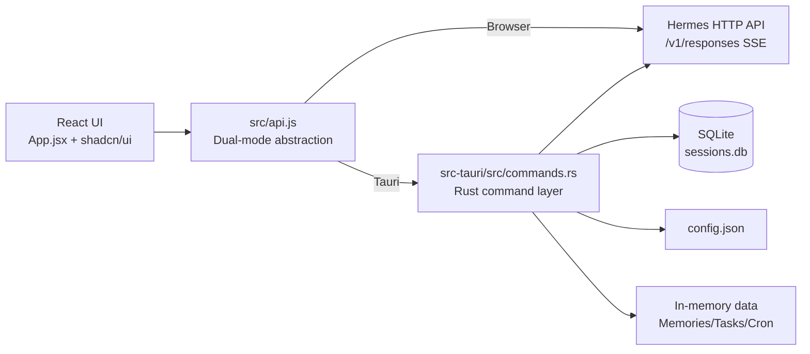

<div align="center">

[](README.zh-CN.md)
[](README.md)

</div>

*👉 [View Chinese Version](README.zh-CN.md) | [查看中文版](README.zh-CN.md)*

---

> Hermes AI Agent desktop client - Built with Tauri 2 + React 19 (macOS first)

---

## 📸 Preview

<div align="center">

**Chat** | **Sessions** | **Files** | **Terminal**
:---:|:---:|:---:|:---:
 |  |  | 

**Workspace Manager** | **Tasks** | **Cron** | **Commands**
:---:|:---:|:---:|:---:
 |  |  | 

</div>

---

## ✨ Core Features (7 Sidebar Modules)

### 1. 💬 Current Session (Chat)
Streaming conversation, Markdown rendering, code highlighting, tool call visualization, attachment support, automatic context trimming.  
**New**: AI thinking process display (reasoning chain visualization for thinking mode).

### 2. 📚 Sessions List
Historical session management: create, switch, rename, delete, pin, search. Data persisted to SQLite.  
**New**: Automatic session summary generation for quick context recall.

### 3. ⏰ Scheduled Tasks (Cron)
Cron job list, create/delete, expression support.  

### 4. 📂 File Manager
File tree browsing, preview (code highlighting), editing (Tauri mode), create/rename/delete.

### 5. 💻 Terminal
xterm.js integration + PTY sessions, supports bash/zsh/sh, interactive shell commands.

### 6. ✅ Task Manager
TODO/IN_PROGRESS/DONE status transitions, progress stats, CRUD.  

### 7. 📖 Hermes Commands
Built-in command reference manual, categorized browsing, search, one-click copy.

---

## 🔄 Workspace Switching

This is the core design pattern of the app.

Through the `WorkspaceSwitcher` component (bottom of sidebar) or settings, you can create, switch, and delete workspaces.

**When switching workspaces, everything switches**:
- Sessions list → filtered to current workspace's conversations
- File browser → automatically opens to workspace directory
- Terminal → cwd automatically switches to workspace path
- Tasks, Cron, Env, Memory → isolated per workspace

**Implementation**:
- Workspace list stored in `~/.hermes/hermes-desktop-lite/config.json`
- Each workspace has `id`, `name`, `path`, `icon` fields
- Frontend state: `currentWorkspace` and `workspaces` in `App.jsx`
- Backend commands: `get_workspaces`, `switch_workspace`, `create_workspace`, etc. (`commands.rs`)

This is equivalent to an **independent local sandbox** for each project.

---

## ⚙️ Settings & Model Selector

**Settings Modal**:
- Gateway address/port configuration + connection test
- Theme switch (light/dark/system)
- Language switch (zh/en/zh-tw)
- Agent selection (currently Hermes Agent only)

**Model Selector** (top-right in chat):
- Select model for current session
- Shows default model
- Auto-loads available models from configuration

> **Note**: Model configuration (API Key, Base URL, etc.) is managed via Hermes environment variables. **The client does not provide a configuration UI**.

---

## 🏗️ Architecture



**Tech Stack**:

| Layer | Tech | Version |
|------|------|--------|
| Desktop Framework | Tauri | 2.10.1 |
| Frontend Framework | React | 19.2.4 |
| Build Tool | Vite | 8.0.4 |
| UI Components | shadcn/ui + Radix UI | Local |
| Styling | Tailwind CSS | 4.2.2 |
| Animation | Framer Motion | 12.38.0 |
| Terminal | xterm.js | 5.3.0 |
| Icons | Lucide React | 1.8.0 |
| Theme | next-themes | 0.4.6 |
| Notifications | Sonner | 2.0.7 |
| Backend Language | Rust | 2021 edition |

**Platform Support**: macOS (priority) → Linux → Windows (later)

---

## 🛠️ Development Guide

### Project Structure

```
hermes-desktop-lite/
├── src/                          # Frontend source
│   ├── App.jsx                   # Root component (state management + routing)
│   ├── api.js                    # Hermes API abstraction layer
│   ├── components/               # UI components
│   │   ├── ChatWorkspace.jsx     # Chat main view
│   │   ├── SessionsView.jsx      # Sessions list
│   │   ├── FilesView.jsx         # File manager
│   │   ├── TerminalView.jsx      # Terminal
│   │   ├── TasksView.jsx         # Task manager
│   │   ├── CronView.jsx          # Scheduled tasks
│   │   ├── CommandsView.jsx      # Hermes commands
│   │   ├── SettingsModal.jsx     # Settings modal
│   │   ├── WorkspaceSwitcher.jsx # Workspace switcher
│   │   └── WorkspaceManagerDialog.jsx # Workspace manager dialog
│   ├── locales/                  # i18n (zh/en/zh-tw)
│   └── lib/                      # Utilities
├── src-tauri/                    # Rust backend
│   ├── src/
│   │   ├── commands.rs           # Tauri commands 
│   │   ├── lib.rs                # App initialization
│   │   └── main.rs               # Entry point
│   ├── Cargo.toml
│   └── tauri.conf.json
├── screenshots/                  # App screenshots
├── package.json
├── vite.config.js
└── README.md                     # This file
```

### Code Conventions

- **Frontend**: Functional components + Hooks, 2-space indent, PascalCase components, camelCase functions
- **Backend**: Rust 2021 edition, snake_case
- **Styling**: Tailwind CSS 4 + CSS variable theming
- **i18n**: `react-i18next` + `TranslationContext`

### Debugging Tips

**Frontend**:
- React DevTools to inspect component state
- Network panel for SSE streams (`/v1/responses`)
- Console: `window.__TAURI__` to check runtime mode

**Backend**:
```bash
# Run Rust directly to debug Tauri commands
cargo run

# View SQLite database
open ~/.hermes/hermes-desktop-lite/sessions.db
```

### Code Navigation

**Key entry points**:
- Frontend entry: `src/main.jsx` → `ReactDOM.createRoot` → `App.jsx`
- API layer: `src/api.js` → `isTauri()` branch
- Backend entry: `src-tauri/src/main.rs` → `tauri::Builder` → `lib.rs`
- Command registration: `tauri::generate_handler!` in `src-tauri/src/lib.rs`

 