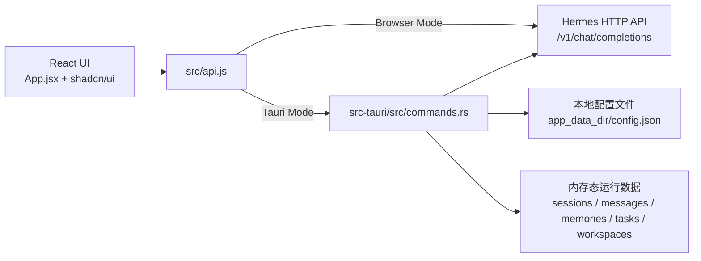
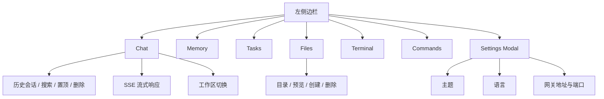

# Hermes Desktop Lite

Hermes Desktop Lite 是一个基于 React + Vite + Tauri 2 的桌面端原型工程，用来把本地 Hermes Agent 的聊天能力包装成一个带侧边栏、多视图和设置面板的桌面应用。

这个仓库当前更接近“可运行的产品原型”而不是完整产品：

- 聊天主流程、Hermes 网关连接检测、主题/语言切换已经可以跑通
- 整体界面基于 `shadcn/ui` 组件体系和本地落地组件源码构建
- `Memory`、`Cron`、`Tasks`、`Files`、`Terminal` 等页面已经有完整交互外壳
- 一部分后端数据仍是内存态或 mock 实现，不能按生产能力理解

> 当前最重要的阅读方式：把它看成一个 Hermes 桌面端 UI/交互原型 + Tauri 集成实验项目，而不是一个已经完成数据持久化和真实文件管理能力的成品。

## 项目概览



## 界面组成



## 当前功能状态

| 模块 | 当前状态 | 说明 |
| --- | --- | --- |
| Chat 主界面 | 可用 | 支持发送消息、接收流式 token、错误提示、上下文裁剪 |
| Hermes 连接检测 | 可用 | 可检测网关地址与端口，默认目标为 `127.0.0.1:8642` |
| 主题 / 语言设置 | 可用 | 支持浅色 / 深色 / 跟随系统，支持中英繁切换 |
| 会话列表 | 部分可用 | 支持搜索、置顶、删除、选择；当前 Tauri 后端仍为内存态，重启后会重置 |
| Memory 页面 | 原型可用 | 页面交互完整，增删改查与“整合”入口存在；当前数据为内存态 |
| Tasks 页面 | 原型可用 | 支持创建、切换状态、删除；当前数据为内存态 |
| Files 页面 | UI 原型 | 页面流程完整，但当前 Tauri 文件命令仍为 mock 实现 |
| Terminal 页面 | 基础可用 | 通过 Tauri PTY 提供内置终端会话 |
| Commands 页面 | 可用 | 提供 Hermes 命令参考与分类浏览 |
| Workspace 切换 | 基础可用 | 有默认工作区切换 UI；完整管理能力仍未完成 |
| Hermes 版本信息 | 部分可用 | 可读取本机 `hermes --version`，并查询最新 release 信息 |
| Hermes 更新 | 部分可用 | 桌面模式下会尝试执行 `hermes update` |

## 适合做什么

- 迭代 Hermes 桌面端视觉和交互方案
- 验证 Tauri 桌面壳与本地 HTTP Agent 的集成方式
- 拆分聊天、设置、文件、记忆等多视图桌面应用结构
- 作为后续真实持久化、真实文件系统接入前的前后端对接骨架

## 现在还不适合做什么

- 作为生产可用的对话历史管理工具
- 作为真实文件浏览器或编辑器使用
- 作为具备完整数据持久化能力的桌面知识库
- 作为多 Agent、多工作区的成熟管理应用

## 技术栈

| 层级 | 技术 |
| --- | --- |
| 桌面壳 | Tauri 2 |
| 前端 | React 19, Vite 8 |
| UI | Tailwind CSS 4, `shadcn/ui`, Radix UI, Lucide |
| 动效与主题 | Framer Motion, `next-themes`, Sonner |
| 后端命令层 | Rust |
| Agent 接入 | Hermes HTTP API, SSE 流式响应 |
| 多语言 | `zh` / `en` / `zh-tw` |

## 运行模式

### 1. 纯前端模式

适合只改 UI、样式、交互结构。

```bash
npm install
npm run dev
```

默认访问地址通常为：

```text
http://localhost:5173/
```

说明：

- 此模式只启动 Vite，不启动 Tauri 桌面壳
- `src/api.js` 会根据是否处于 Tauri 环境决定走 mock 或浏览器侧逻辑
- 浏览器模式下，部分设置走 `localStorage`，部分数据使用 mock 返回值

### 2. 桌面开发模式

适合联调 Tauri 命令、设置保存、桌面窗口行为。

```bash
npm install
npm run tauri -- dev
```

建议准备：

- Node.js 20+
- Rust 工具链
- Tauri 运行环境
- 可选的 Hermes 服务进程

默认 Hermes 目标地址：

```text
http://127.0.0.1:8642
```

如果 Hermes 没有启动：

- App 仍然可以打开
- Chat 页面会显示未连接状态
- 可以在设置面板里修改 host / port 并重新测试连接

### 3. 构建

前端静态资源构建：

```bash
npm run build
```

桌面应用构建：

```bash
npm run tauri -- build
```

当前第一阶段打包目标为：

- `macOS universal`（`app` + `dmg`）
- `linux x64 deb`
- `linux arm64 deb`

## 仓库结构

```text
.
├── src/
│   ├── App.jsx                 # 主界面与多视图调度
│   ├── api.js                  # 浏览器 / Tauri 双模式 API 封装
│   ├── data.js                 # 命令模板与静态展示数据
│   ├── locales/                # i18n 文案
│   ├── components/
│   │   ├── ui/                 # 本地落地的 shadcn/ui 组件
│   │   ├── FileView.jsx        # 文件视图
│   │   └── ...
│   ├── MemoryView.jsx
│   ├── TaskView.jsx
│   └── SettingsModal.jsx
├── src-tauri/
│   ├── src/lib.rs              # Tauri 命令注册
│   ├── src/commands.rs         # Rust 命令实现
│   └── tauri.conf.json         # Tauri 配置
├── doc/                        # 产品设计 / 架构设计文档
└── README.md
```

## 浏览器模式与桌面模式的区别

| 能力 | 浏览器模式 | Tauri 桌面模式 |
| --- | --- | --- |
| UI 调试 | 支持 | 支持 |
| Tauri 命令 | 不支持 | 支持 |
| 设置本地持久化 | `localStorage` | 本地 `config.json` |
| 聊天请求 | 直接请求 Hermes HTTP API | 通过 Tauri 命令转发 |
| 文件 / 会话 / 任务等数据 | 部分 mock | 目前多数仍是内存态或 mock |

## 已知限制

这些限制是当前代码状态的一部分，不是文档省略：

- 会话历史与消息在当前 Tauri 实现中仍是内存态，应用重启后会重置
- `Memory`、`Tasks`、`Workspace` 等数据目前主要也是演示性质的内存存储
- `Files` 页面的 `list/read/write/delete/create` 命令当前仍是 mock 返回值
- 技能相关 API 已实现，但当前主界面未挂载独立 `Skills` 页面
- 当前 Agent 列表只有 `hermes-agent`
- Linux `deb` 产物需要在原生 Linux runner 或 Linux 主机上构建

## 设计与规划文档

如果你想看更细的设计背景，可以继续读这些文档：

- [产品设计文档](./doc/01-产品设计/Hermes-desktop-lite产品设计文档.md)
- [功能规划 v2](./doc/02-架构设计/功能规划-v2.md)
- [详细功能设计 v2.1](./doc/02-架构设计/详细功能设计-v2.1.md)
- [开发计划](./doc/02-架构设计/开发计划.md)
- [命令与技能整理](./doc/APP_SKILLS_COMMANDS.md)

## 快速判断这个仓库值不值得看

如果你关心的是下面这些问题，这个仓库是有参考价值的：

- 怎么用 Tauri 把一个本地 AI Agent HTTP 服务包成桌面应用
- 怎么用 `shadcn/ui` 搭一个多视图 AI 桌面端原型
- 怎么把聊天、设置、文件、任务、记忆等能力塞进一个统一侧边栏框架
- 怎么在“先做交互原型”阶段把前端和 Rust 命令层先串起来

如果你需要的是下面这些内容，这个仓库暂时还不够：

- 完整的会话持久化实现
- 真实文件系统浏览与编辑
- 可生产部署的 Agent 桌面客户端
- 完整的权限、安全、数据迁移与升级方案
