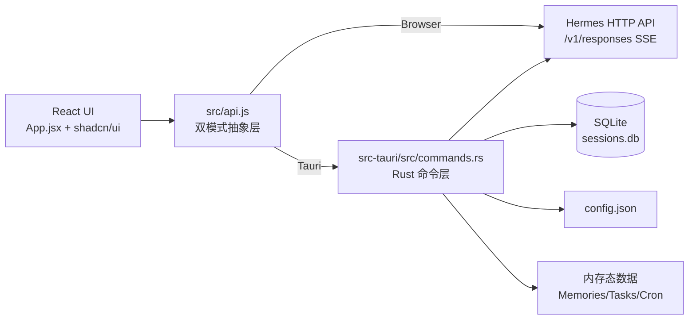

# 🚀 Hermes Desktop Lite

[](LICENSE)
[](CONTRIBUTING.md)
[](https://tauri.app/)
[](https://react.dev/)
[](https://vitejs.dev/)
[](https://tailwindcss.com/)
[](https://ui.shadcn.com/)

> Hermes AI Agent 的桌面客户端 - 基于 Tauri 2 + React 19 构建（当前支持 macOS）

---

## 📸 应用预览

<div align="center">

**主界面（聊天视图）** | **侧边栏导航** | **文件管理** | **终端集成**
:---:|:---:|:---:|:---:
 |  |  | 

**设置面板** | **日志管理** | **快捷指令查看** | **Cron 调度**
 |  |  | 

</div>

> **提示**：以上为截图占位符，请将实际截图放置于 `screenshots/` 目录，并确保文件名匹配。

---

## ✨ 核心功能（7 大侧边栏模块）

### 1. 💬 当前会话（Chat）
流式对话、Markdown 渲染、代码高亮、工具调用可视化、附件支持、上下文自动裁剪。

### 2. 📚 会话列表（Sessions）
历史会话管理：创建、切换、重命名、删除、置顶、搜索。数据持久化到 SQLite。

### 3. ⏰ 定时任务（Cron）
Cron 作业列表、创建/删除、表达式支持。 

### 4. 📂 文件管理（Files）
文件树浏览、预览（代码高亮）、编辑（Tauri 模式）、新建/重命名/删除。

### 5. 💻 终端操作（Terminal）
xterm.js 集成 + PTY 会话，支持 bash/zsh/sh，交互式 Shell 命令。


### 7. 📖 Hermes 指令（Commands）
内置命令参考手册，分类浏览、搜索、一键复制。

---

## ⚙️ 设置与模型选择

**设置面板**（Settings Modal）：
- 网关地址/端口配置 + 连接测试
- 主题切换（亮/暗/系统）
- 语言切换（中/英/繁）
- Agent 选择（当前仅 Hermes Agent）

**模型选择**（聊天界面右上角）：
- 选择当前会话使用的模型
- 显示默认模型
- 自动从配置读取可用模型列表

> **注意**：模型配置（API Key、Base URL 等）通过 Hermes 环境变量管理，**客户端不提供配置界面**。

---

## 🏗️ 架构设计



**技术栈**：

| 层级 | 技术 | 版本 |
|------|------|------|
| 桌面框架 | Tauri | 2.10.1 |
| 前端框架 | React | 19.2.4 |
| 构建工具 | Vite | 8.0.4 |
| UI 组件 | shadcn/ui + Radix UI | 本地落地 |
| 样式系统 | Tailwind CSS | 4.2.2 |
| 动效库 | Framer Motion | 12.38.0 |
| 终端 | xterm.js | 5.3.0 |
| 图标 | Lucide React | 1.8.0 |
| 主题 | next-themes | 0.4.6 |
| 通知 | Sonner | 2.0.7 |
| 后端语言 | Rust | 2021 edition |

**平台支持**：macOS（优先）→ Linux → Windows（后续）

---

## 🚀 快速开始

### 环境要求

- **Node.js** ≥ 20
- **Rust**（Tauri 开发需要）: `curl --proto '=https' --tlsv1.2 -sSf https://sh.rustup.rs | sh`
- **系统依赖**：请参考 [Tauri 官方文档](https://tauri.app/v1/guides/getting-started/prerequisites)

### 安装与运行

```bash
# 克隆仓库
git clone https://github.com/8187735/hermes-desktop-lite.git
cd hermes-desktop-lite

# 安装依赖
npm install

# 启动 Tauri 桌面应用
npm run tauri dev
```

自动打开桌面窗口。

**前提**：Node.js ≥ 20、Rust 环境、本地运行 Hermes Agent（默认端口 8642）。

**Hermes Gateway 默认地址**：http://127.0.0.1:8642

> 如果本地未运行 Hermes Agent，Chat 页面会显示未连接状态，可通过设置面板修改地址。

---

## 📦 构建发布

### 桌面版本（当前仅 macOS）

```bash
# macOS Universal（包含 Intel + Apple Silicon）
npm run build:mac:universal
```

构建产物位于 `src-tauri/target/release/bundle/`

**后续平台支持**：
- Linux（x64/ARM64 DEB）—— 开发完成后提供
- Windows（MSI/EXE）—— 视情况支持

---

## 🎯 功能状态

| 模块 | 状态 | 说明 |
|------|------|------|
| 💬 当前会话（Chat） | ✅ 完整 | 流式响应、Markdown、工具可视化、上下文管理 |
| 📚 会话列表（Sessions） | ✅ 完整 | CRUD、置顶、搜索、SQLite 持久化 |
| ⏰ 定时任务（Cron） | ⚠️ UI 完整 | 列表/创建/删除已完成，调度执行未实现 |
| 📂 文件管理（Files） | ✅ 完整（Tauri） | 浏览/预览/编辑/删除，浏览器模式为 Stub |
| 💻 终端操作（Terminal） | ✅ 完整 | xterm.js + PTY 会话，支持交互式 Shell |
| ✅ 任务管理（Tasks） | ⚠️ UI 完整 | 状态流转、进度统计，数据未持久化 |
| 📖 Hermes 指令（Commands） | ✅ 完整 | 命令参考手册，分类浏览 + 搜索 |
| ⚙️ 设置面板（Settings） | ✅ 完整 | 主题/语言/网关/Agent 配置 |
| 🔌 模型选择（Model Selector） | ✅ 可用 | 聊天右上角下拉菜单选择模型（配置在 Hermes 环境变量） |


---

## 📊 数据持久化状态总览

| 数据类型 | 存储方式 | 位置 | 状态 |
|---------|---------|------|------|
| 会话（Sessions） | SQLite | `~/.hermes/hermes-desktop-lite/sessions.db` | ✅ 持久化 |
| 消息（Messages） | SQLite（关联会话） | 同上 | ✅ 持久化 |
| 配置（Config） | JSON 文件 | `~/.hermes/hermes-desktop-lite/config.json` | ✅ 持久化 |
| Cron Jobs | 内存 static Mutex<Vec<>> | Rust 后端 | ✅ 持久化|
| Env Vars | 内存 static Mutex<Vec<>> | Rust 后端 | ✅ 持久化 |

---

## 📋 快速参考

### 常用命令

```bash
# 开发启动（Tauri 桌面模式）
npm run tauri -- dev

# 构建（macOS Universal）
npm run build:mac:universal

# 代码检查
npm run lint
```

### 调试技巧

**前端**：
- React DevTools：检查组件状态
- Network：查看 SSE 流
- Console：`window.__TAURI__` 判断模式

**后端**：
- `cargo run` 直接运行 Rust（调试 Tauri 命令）
- `println!` 日志输出
- 查看 `~/.hermes/hermes-desktop-lite/sessions.db`（DB Browser for SQLite）

### 代码导航

**关键入口**：
- 前端入口：`src/main.jsx` → `ReactDOM.createRoot` → `App.jsx`
- API 层：`src/api.js` → `isTauri()` 分支
- 后端入口：`src-tauri/src/main.rs` → `tauri::Builder` → `lib.rs`
- 命令注册：`src-tauri/src/lib.rs` 的 `tauri::generate_handler!`

---

## 🛠️ 开发指南

### 项目结构

```
hermes-desktop-lite/
├── src/                          # 前端源码
│   ├── App.jsx                   # 主应用容器（1557 行 - 建议拆分）
│   ├── api.js                    # API 抽象层（1443 行 - 建议模块化）
│   ├── SessionsView.jsx          # 会话视图
│   ├── MemoryView.jsx            # 记忆视图
│   ├── TaskView.jsx              # 任务视图
│   ├── FileView.jsx              # 文件视图
│   ├── TerminalView.jsx          # 终端视图
│   ├── SettingsModal.jsx         # 设置弹窗
│   ├── components/ui/            # shadcn/ui 组件（16 个）
│   ├── locales/                  # i18n 文案（zh/en/zh-tw）
│   └── lib/                      # 工具函数
├── src-tauri/                    # Rust 后端
│   ├── src/
│   │   ├── commands.rs           # Tauri 命令（3549 行 - 建议模块化）
│   │   ├── lib.rs                # 应用初始化
│   │   └── main.rs               # 入口
│   ├── Cargo.toml
│   └── tauri.conf.json
├── doc/                          # 设计文档
├── package.json
├── vite.config.js
└── README.md                     # 本文件
```

### 代码规范

- **前端**：函数式组件 + Hooks，2 空格缩进，组件 PascalCase，函数 camelCase
- **后端**：Rust 2021 edition，snake_case 命名
- **样式**：Tailwind CSS 4，CSS 变量主题系统
- **国际化**：`react-i18next` + `TranslationContext`

### 调试技巧

**前端**：
- React DevTools 检查组件状态
- Network 面板查看 SSE 流（`/v1/responses`）
- Console 执行 `window.__TAURI__` 判断运行模式

**后端**：
```bash
# 直接运行 Rust 调试 Tauri 命令
cargo run

# 查看 SQLite 数据库
open ~/.hermes/hermes-desktop-lite/sessions.db
```

---
 

## 🤝 贡献指南

欢迎提交 Issue 和 Pull Request！

**开发前请阅读**：
- [AGENTS.md](./AGENTS.md) - 本地开发约定
- [PROJECT_ANALYSIS.md](./PROJECT_ANALYSIS.md) - 完整项目分析报告
- [doc/](./doc/) - 产品设计文档与架构规划

**提交规范**：
- 遵循 Conventional Commits
- 确保通过 ESLint 检查：`npm run lint`
- 更新相关文档

---

## 📚 参考资料

- [Hermes Agent 官方指南](https://hermes.xaapi.ai/guide/introduction)
- [Hermes Skills Marketplace](https://hermes-agent.nousresearch.com/docs/skills)
- [Tauri 文档](https://tauri.app/v1/guides/)
- [shadcn/ui 组件库](https://ui.shadcn.com/)
- [Tailwind CSS 文档](https://tailwindcss.com/)

---

## ❤️ 致谢

- [Hermes Agent](https://github.com/NousResearch/hermes-agent) - 强大的本地 AI Agent
- [Tauri](https://tauri.app/) - 下一代桌面应用框架
- [shadcn/ui](https://ui.shadcn.com/) - 精美的 React 组件
- [xterm.js](https://xtermjs.org/) - 终端模拟器

---

## 📄 许可证

MIT License - 详见 [LICENSE](./LICENSE) 文件

---

**⭐ 如果这个项目对你有帮助，请给个 Star！**

**🐛 遇到问题？** 请先查看 [Issues](../../issues) 是否已有解决方案，没有则提交新 Issue。

**💡 有建议？** 欢迎在 [Discussions](../../discussions) 中分享你的想法。

---

*最后更新：2026-04-23 | 项目状态：活跃开发中*
