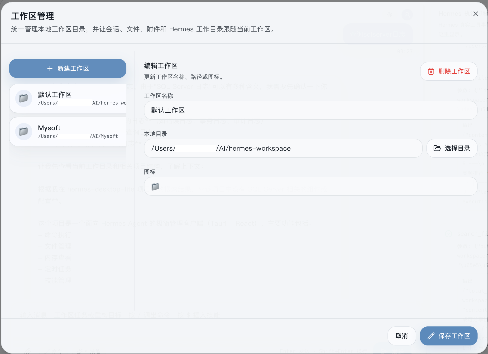
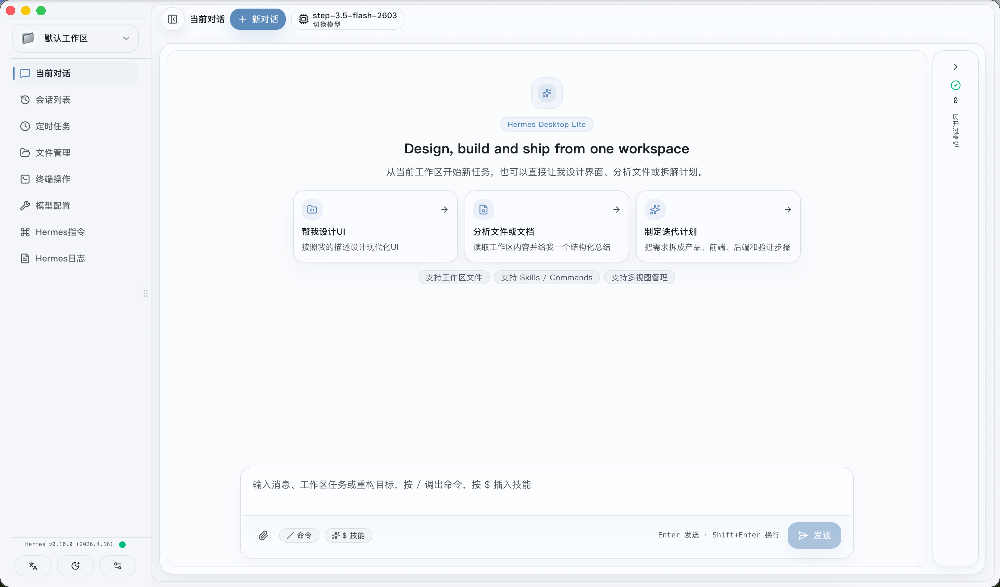
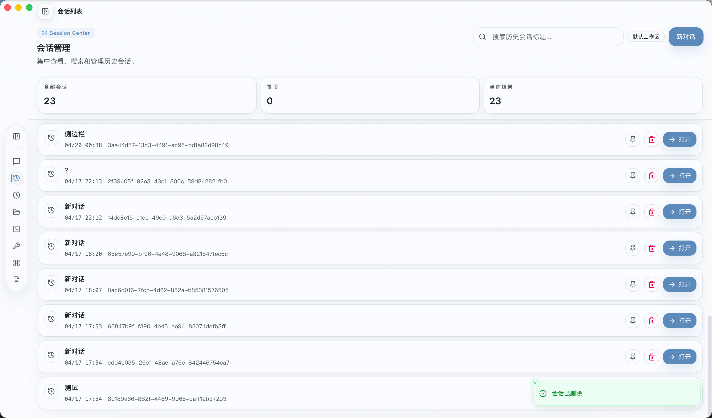
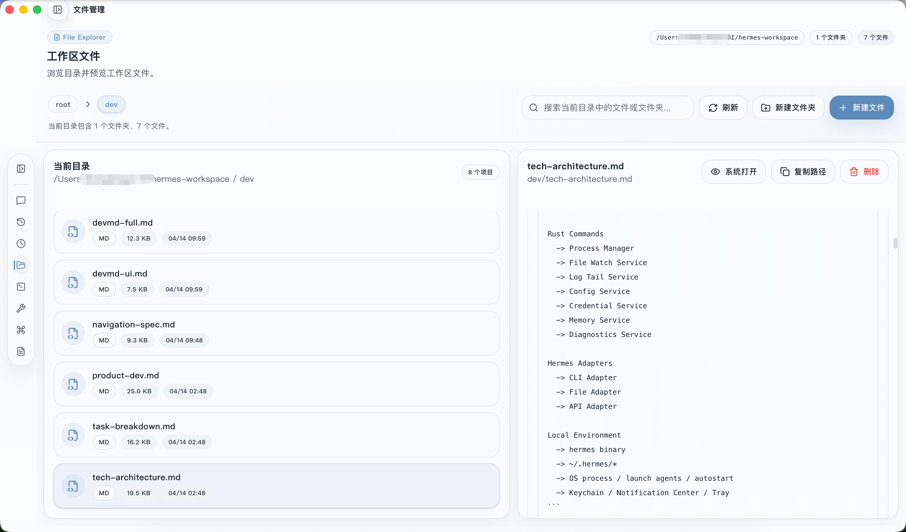
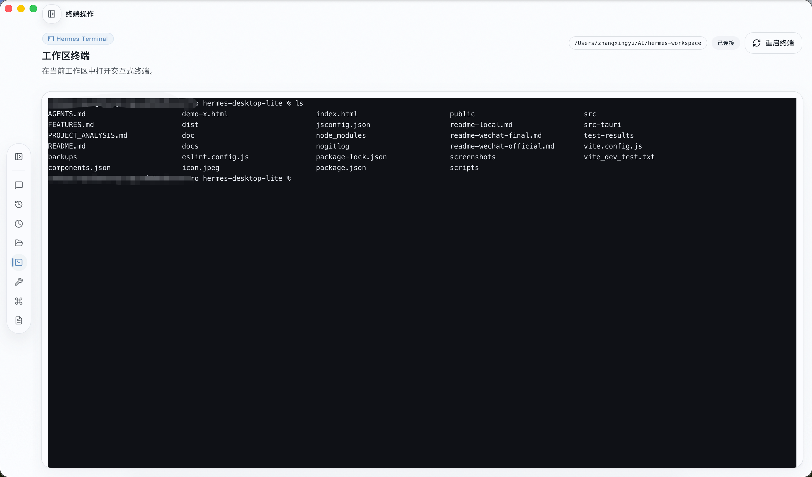
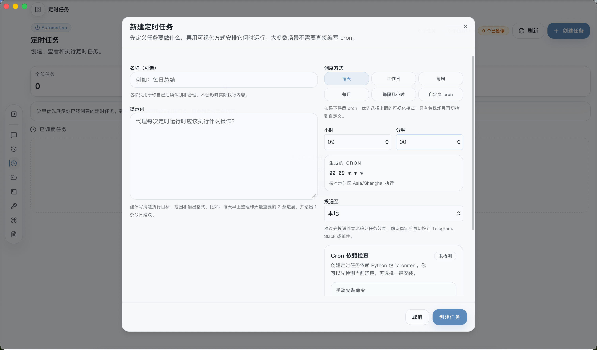

# 安利一个hermes agent的极简桌面客户端，把本地 AI Agent 装进 Dock 栏

## 前言：造个小轮子

这次不一样——我不是要再造一个「更强大」的 Hermes agent control ui，而是想做一个**更像应用的 Hermes**。

Hermes Agent 本身很强：本地跑模型、管理记忆、执行文件、调用工具……但它主要是 **CLI + Web 后台**的形态。

对于开发者来说很爽，但对于「想把它当作日常 AI 助手」的人来说，**总觉得缺了点什么**。

缺的是一个**真正放在 Dock 栏、点开就能聊、随时查文件、像普通软件一样使用**的桌面客户端。

所以我做了 **Hermes Desktop Lite**——一个专注于「日常使用」的极简桌面客户端。

---

## 核心亮点：工作区切换

这是整个应用的设计灵魂。

你可以**创建多个工作区**，每个对应一个本地目录。切换时，**所有内容跟着切换**：
- 会话列表 → 自动过滤到该工作区的对话
- 文件浏览 → 自动打开到该工作区目录
- 终端 cwd → 自动 cd 到该路径
- 任务、记忆等 → 按工作区隔离

**相当于为每个项目准备了一个独立沙箱**。

例如：
- `~/projects/webapp` —— 前端开发沙箱
- `~/projects/backend` —— 后端服务沙箱
- `~/personal/notes` —— 个人笔记沙箱

每个沙箱有独立的对话上下文、文件系统、任务列表，**互不干扰**。

<div align="center">

<br>
<p><em>工作区管理界面</em></p>

</div>

---

## 7 个真正可用的功能

侧边栏 7 个入口，每个都是高频场景。

---

### 1. 当前会话 — 聊天

主界面。流式对话、Markdown 渲染、工具调用可视化、附件粘贴、上下文自动管理。

**新增：AI 思考过程可见**  
支持 thinking 模式时，能看见模型的完整推理链。

<div align="center">

<br>
<p><em>聊天界面 - 菜单展开</em></p>

<br>
<p><em>聊天界面 - 菜单收起</em></p>

<br>
<p><em>模型下拉选择（右上角）</em></p>

</div>

---

### 2. 会话列表 — 历史记录

所有历史会话一目了然：创建、切换、重命名、删除、置顶、搜索。数据持久化到 SQLite。

**新增：智能摘要**  
每个会话卡片显示 AI 生成的摘要，快速回忆对话内容。

<div align="center">

<br>
<p><em>历史会话列表，支持搜索和置顶</em></p>

</div>

---

### 3. 文件管理 — 浏览与编辑

文件树浏览、代码语法高亮、**Tauri 模式下可直接编辑保存**、新建/重命名/删除。

<div align="center">

<br>
<p><em>文件树浏览与代码预览</em></p>

</div>

---

### 4. 终端操作 — 内置 xterm

基于 xterm.js 的完整终端，支持 bash/zsh/sh，交互式命令随便跑。无需再开 iTerm。

<div align="center">

<br>
<p><em>内置 xterm 终端，支持交互式 Shell</em></p>

</div>

---

### 5. 任务管理 — 简单看板

TODO / 进行中 / 已完成 三种状态，点击切换，进度统计。⚠️ 数据目前存于内存，重启丢失。

<div align="center">

<br>
<p><em>任务看板，状态快速切换</em></p>

</div>

---

### 6. 定时任务 — Cron 管理

可视化 Cron 作业：添加/删除、表达式格式提示。UI 已完成，调度执行逻辑在开发中。

<div align="center">

<br>
<p><em>Cron 作业列表与表达式编辑</em></p>

</div>

---

### 7. Hermes 指令 — 命令手册

内置命令参考，分类浏览（会话管理/配置/工具）、搜索、查看详细用法、一键复制。

<div align="center">

<br>
<p><em>命令分类浏览与快速复制</em></p>

</div>

---

## 为什么选它？

### 1. 它是「应用」，不是「控制台」

Hermes Web Admin 是管理后台，功能全但打开成本高。  
Desktop Lite 是日常应用——放在 Dock 栏，点开即用，侧边栏常驻切换无感。

### 2. 数据完全本地

对话记录存本地 SQLite，文件操作直接读写本地磁盘。没有云服务，没有数据上传。

### 3. 轻量原生

基于 Tauri，打包体积小，内存占用低，系统原生体验。

---

## 如何使用？（当前仅 macOS）

### 桌面模式（完整功能）

```bash
# 克隆仓库
git clone https://github.com/your-username/hermes-desktop-lite.git
cd hermes-desktop-lite

# 安装依赖
npm install

# 启动桌面应用
npm run tauri dev
```

**前提**：Node.js ≥ 20、Rust 环境、本地运行 Hermes Agent（默认端口 8642）。

### 打包发布（macOS Universal）

```bash
npm run build:mac:universal
```

**后续支持**：Linux → Windows

---

## 常见问题

**Q：这是官方的吗？**  
不是，第三方社区项目。

**Q：数据安全吗？**  
所有数据都在本地，不会上传云端。

**Q：模型配置在哪里？**  
模型配置（API Key、Base URL）通过 Hermes 环境变量管理，客户端右上角下拉菜单选择模型。

---

## 适合谁？

| 如果你… | 那么适合你 |
|---------|-----------|
| 已经在用 Hermes，但很少打开 Web Admin | ✅ 这就是为你做的 |
| 想要一个「点开就用」的本地 AI 客户端 | ✅ 符合预期 |
| 喜欢极简设计，讨厌功能堆砌 | ✅ 你会喜欢 |

---

## 行动

**第 1 步：Star 支持**  
👉 [Git 仓库](https://gitee.com/8187735/hermes-desktop-lite)

**第 2 步：下载试用**  
👉 当前版本优先支持 **macOS**，下载 Release 或自行编译运行
 

**项目地址**：https://gitee.com/8187735/hermes-desktop-lite

---

## 💬 评论区

欢迎在下方留言交流使用体验、问题反馈或功能建议。
 