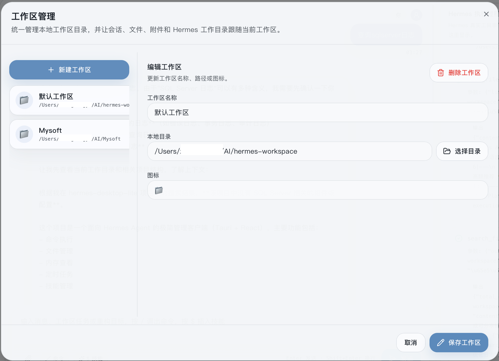
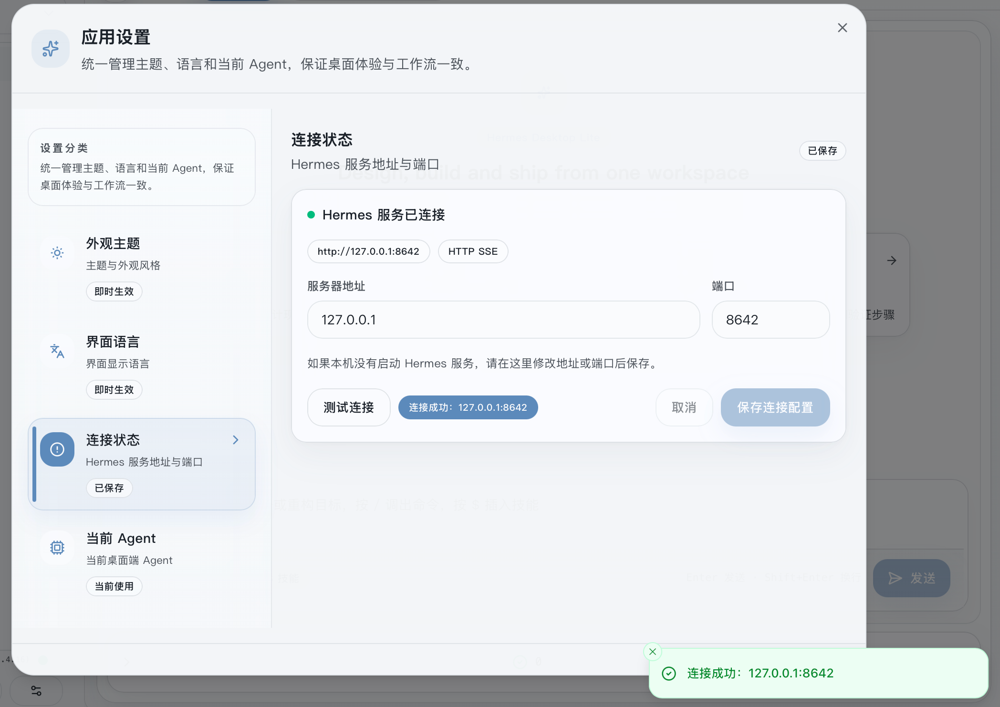
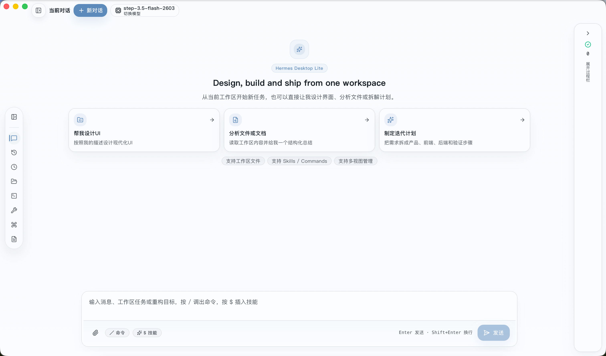
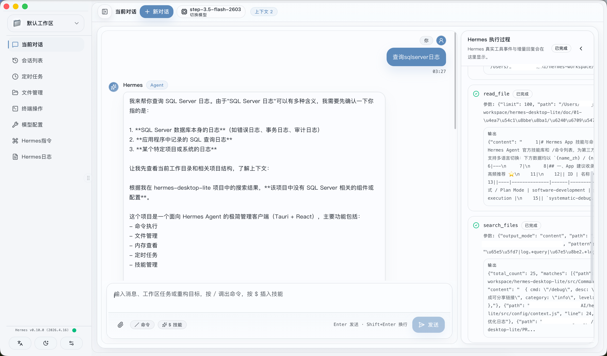
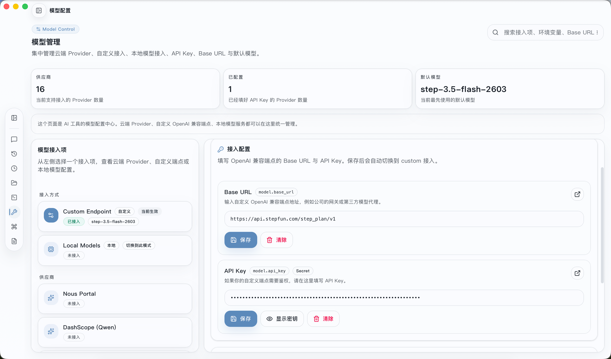
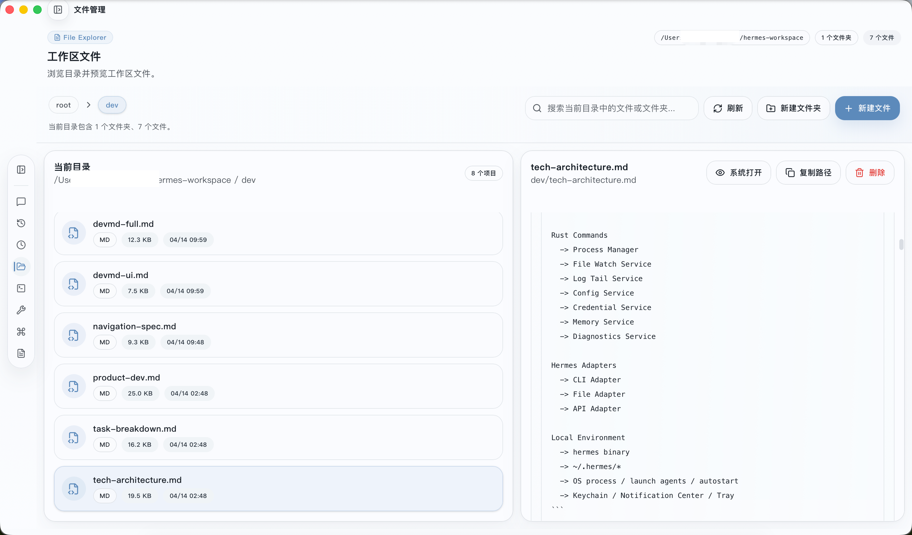
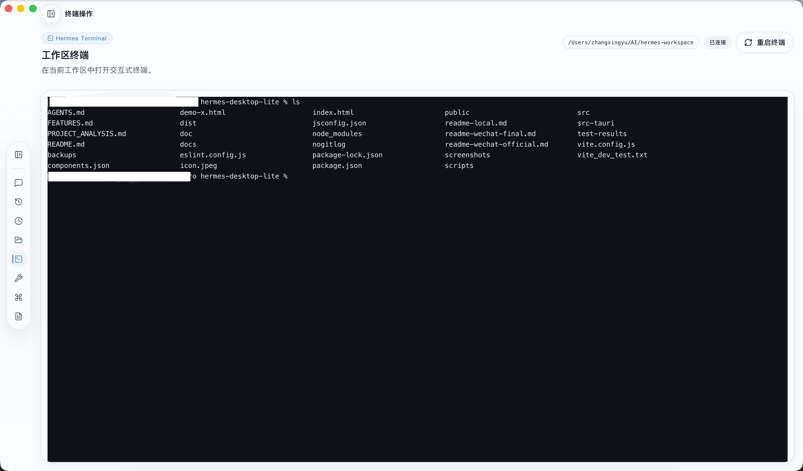
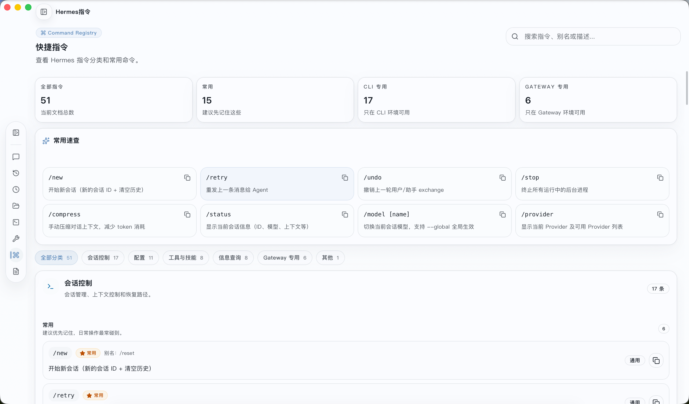
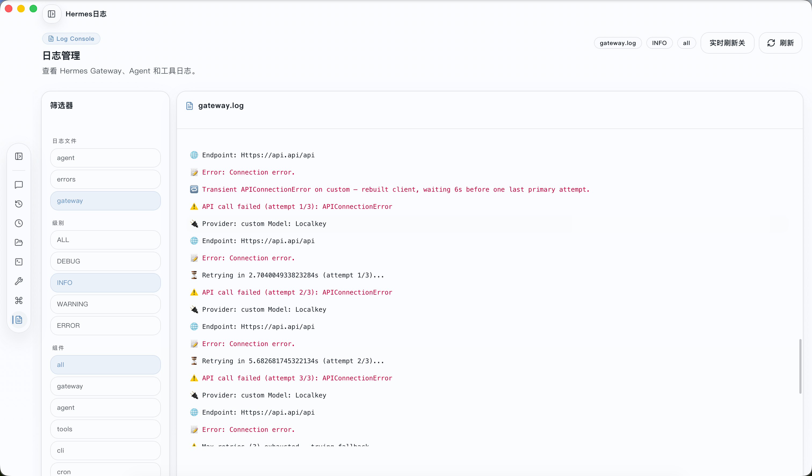

# Hermes Desktop Lite
**Hermes Agent 的极简客户端**

把本地 AI 助手变成 Dock 栏「常用应用」

---

## 🔧 前言

你在用 Hermes Agent 这个强大的 AI智能体框架时，是不是也和我一样：很少打开 Web Admin 后台，也觉得命令行操作不够直观、不够顺手。

不妨试试一个更适合日常使用的客户端：放在 Dock 栏，点开即用；不用记命令、不用切浏览器，界面干净简单，去掉复杂冗余，回归好用、省事、不折腾。

这就是 **Hermes Desktop Lite** —— 为日常使用打造的极简桌面客户端。

---

## 🎯 核心亮点

### 工作区切换

这是整个应用的设计灵魂。你可以**创建多个工作区**，每个对应一个本地目录。切换时，**所有内容跟着切换**：

- 会话列表 → 自动过滤到该工作区的对话
- 文件浏览 → 自动打开到该工作区目录
- 终端 cwd → 自动 cd 到该路径
- 任务、记忆等 → 按工作区隔离

**相当于为每个项目准备了一个独立沙箱**，无需手动 cd/切网页，效率提升。Dock 栏常驻，像使用普通软件一样使用 AI。

---

### 配置地址 + 端口

自定义端口也无需复杂设置，只需在客户端中填入 Hermes Agent 的地址和端口，即可一键连接。

---

## ✨ 8 个真正可用的功能

侧边栏 8 个入口，每个都可能会是日常使用到的场景，**开箱即用**。

### 💬 当前对话

流式回复，Markdown 渲染支持代码/表格/公式，工具调用实时可见，附件直接粘贴。
**✨ AI 思考过程独立展示** —— 右侧专用面板，不占用对话窗口，推理链清晰可见。

### 💬 会话列表

所有历史对话一目了然 · 创建/切换/重命名/删除/置顶/搜索，SQLite 持久化。
**✨ AI 自动生成摘要** —— 快速回忆上下文。

### 📁 文件管理

边聊 AI 边改代码 · 文件树递归浏览，代码高亮预览。
**✨ Tauri 模式下直接编辑保存** —— 无需切换编辑器。

### 💻 终端操作

内置完整终端 · 基于 xterm.js，支持 bash/zsh/sh，交互式 Shell 命令。
**✨ 不用再开 iTerm** —— 一切都在应用内完成。

### ⏰ 定时任务

可视化 Cron 管理 · 添加/删除作业，表达式格式提示。

### 🔧 模型配置

统一管理所有模型 · 本地/远程模型添加、API Key 和 Base URL 配置。
**✨ 右上角下拉菜单快速切换** —— 无需重新配置。

### 📖 Hermes 指令

内置命令手册 · 分类浏览（会话管理/配置/工具）、搜索、查看详细用法。
**✨ 一键复制** —— 方便快捷。

### 📋 Hermes 日志

实时查看 Agent 运行日志 · 日志流显示、过滤搜索、错误高亮。
**✨ 快速定位问题** —— 开发调试好帮手。

---

## 🖼️ 功能界面展示

### 当前对话

### 会话页面

### 模型配置

### 会话列表

### 文件管理

### 终端操作

### 定时任务

### Hermes 指令

### Hermes 日志

---

## 💡 为什么选它？

**🎯 它是「应用」，不是「控制台」**
Desktop Lite 是日常应用——放在 Dock 栏，点开即用，侧边栏常驻切换无感。告别命令行记忆成本，无需开浏览器。

**🔒 数据完全本地**
对话记录存本地 SQLite，文件操作直接读写本地磁盘。没有云服务，没有数据上传，隐私安全。

**⚡ 轻量原生**
基于 Tauri，打包体积小，内存占用低，系统原生体验，启动即用。

**🆚 对比原生 Hermes**
工作区切换让你无需手动 cd/切网页，效率提升。Dock 栏常驻，像使用普通软件一样使用 AI。

---

## 🎯 适合谁？

✅ **已经在用 Hermes，但很少打开 Web Admin** —— 这就是为你做的

✅ **想要一个「点开就用」的本地 AI 客户端** —— 符合预期

✅ **喜欢极简设计，对功能堆砌无感** —— 你会喜欢

---

## 💬 评论区

有疑问？有想法？欢迎在下方留言，有兴趣试用也可以公众号留邮箱，看到后第一时间发送 🔥

---

## 📝 项目地址

Git: https://gitee.com/8187735/hermes-desktop-lite

---
